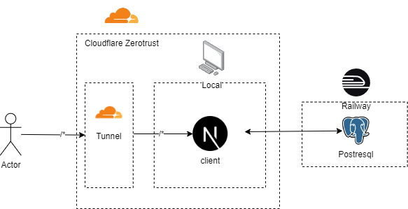
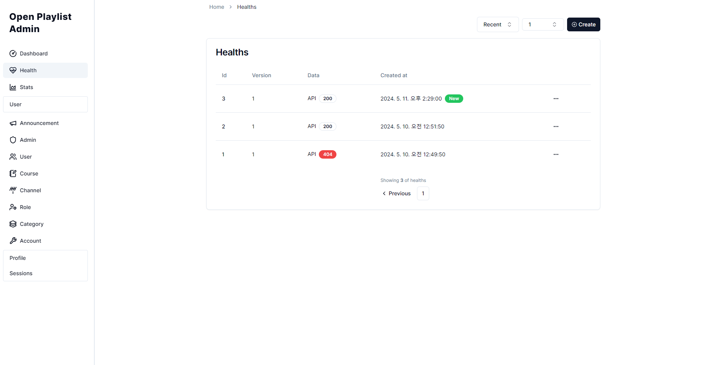
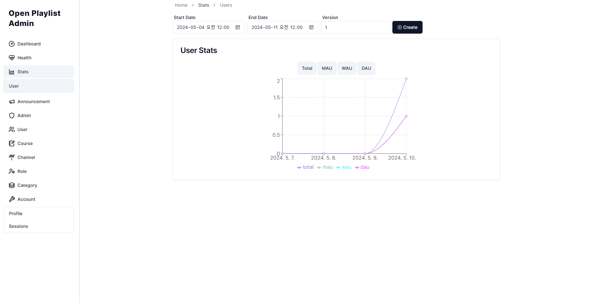
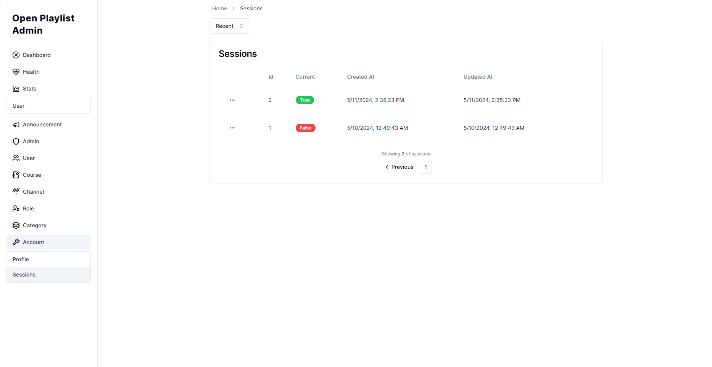

# 오픈 플레이리스트 관리자
## 개요
Open Playlist 웹앱 관리자
## 링크
https://admin.openplaylist.net
## 기술스택
### 백엔드
- NextJs, Typescript
- postgresql  
### 프론트
- NextJs, Typescript, React
### 라이브러리
#### 백엔드
- aws ses
- zod
- Drizzle orm
- jest
- postgresql
#### 프론트
- zustand
- tailwind css
- shadcn ui
- axios
## 아키텍쳐
cloudflare tunnel을 사용해서 집에서 hosting

## ERD

## 기능
#### 1. `health`
- testing api end point response
#### 2. `stats`
- user total, mau, dau, wau
#### 3. `announcement`
- CRUD announcement
#### 4. `admin`
- CRUD admin
#### 5. `user`
- RU user profile
- RU user credit
#### 6. `course`
- RU course
#### 7. `channel`
- RU channelA
#### 8. `role`
- CRUD role
#### 9. `category`
- CRUD category
#### 10. `account`
- manage session
## Docs
- [IA](./docs/IA-admin.md)
- [FlowChart](./docs/FlowChart.md)
- [WBS](./docs/WBS-admin.md)
- [History](./docs/History-admin.md)
- [ERD](./docs/ERD.md)
## Screenshots

